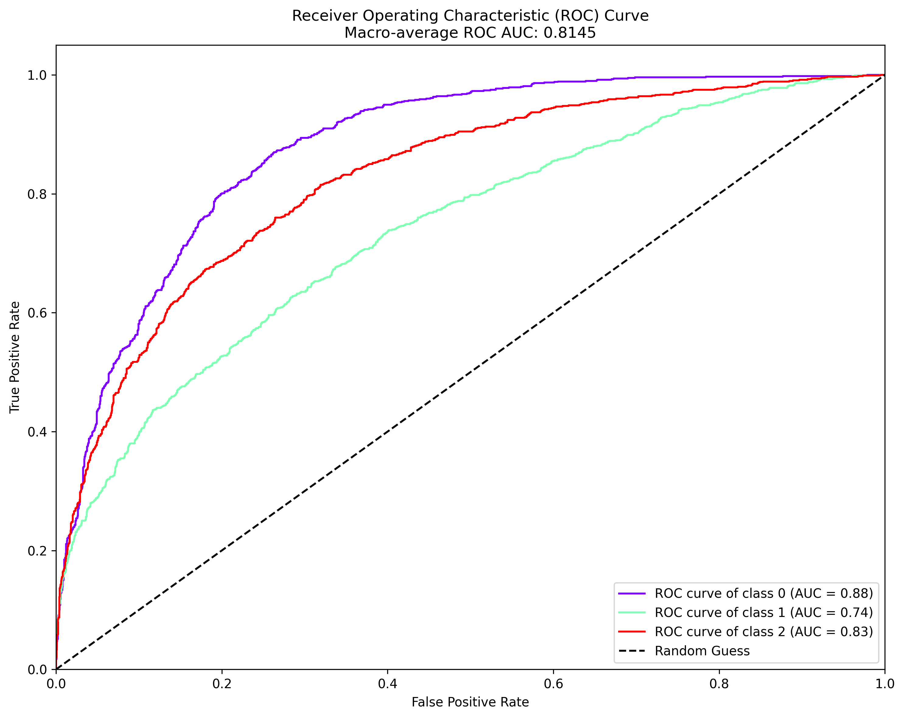
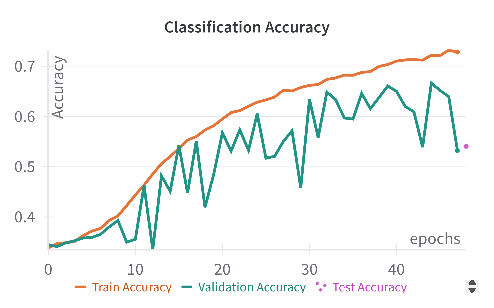
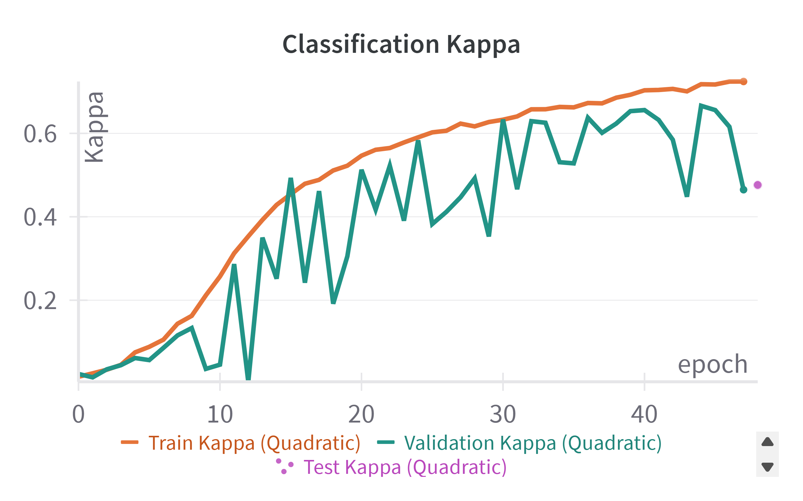

# **Multi-Class Classification of Strong Lensing Images**

## **Problem Statement**

The dataset consists of three classes of strong lensing images:
1. **No Substructure**
2. **Subhalo Substructure**
3. **Vortex Substructure**

The images have been normalized using min-max normalization. However, additional normalization and data augmentation techniques were explored to enhance classification performance.

## **Solution Approach**

### **Model Architecture**
A **[ResNet-18 model](../Multi_Class_Classification/models.py)**, pretrained on ImageNet, was utilized for this classification task. Given that the dataset consists of grayscale images, each image was converted into a three-channel format by stacking the grayscale image thrice.

### **Data Augmentation**
To improve model generalization, the following transformations were applied to the training data:

```
   RandomRotation(degrees=5),
   RandomHorizontalFlip(p=0.1),
   RandomVerticalFlip(p=0.1),
```
---
### **Training Strategy**

1. **Layer-wise Learning Rate Adjustment:**
   - The initial layers of ResNet-18, responsible for capturing local features such as edges and textures, were updated with a lower learning rate (**L1**).
   - The deeper layers, which extract global structural features, were trained with a relatively higher learning rate (**L2**).
   - So the **L1** is kept low wrt **L2** so that pretrained knowledge of model for capturing local features can be utilized.
        - ```L1 = L2 / 40```            ...             where ```L2= 2.0e-4```

2. **Loss Function:**
   - **CrossEntropyLoss** was used as the objective function for training.
   - Label smoothing was done (```label_smoothing=0.1```) for better training process and generalization.

### **Configuration and Pipeline**
The model, dataset, and other components of the training pipeline are detailed in the [configuration file](Multi_Class_Classification/config.yaml)

---

## **Evaluation and Results**

<!--   
### **Figure: Receiver Operating Characteristic (ROC) curve**


### **Figure: Classification Accuracy curve**


**Figure: Classification Kappa curve**


**Figure: Classification Loss curve** -->

<div align="center">
    
    <br>
    <strong>Figure: Receiver Operating Characteristic (ROC) curve</strong>
</div>

<div align="center">
    
    <br>
    <strong>Figure: Classification Accuracy curve</strong>
</div>

<div align="center">
    
    <br>
    <strong>Figure: Classification Kappa curve</strong>
</div>

<div align="center">
    
    <br>
    <strong>Figure: Classification Loss curve</strong>
</div>

---
## **Conclusion**

This approach successfully leveraged transfer learning and fine-tuning strategies to classify strong lensing images into three categories. The implemented augmentations and layer-wise learning rate adjustments improved model performance, achieving a robust classification framework.

For further details and reproducibility, refer to the configuration file and training scripts in the repository.

