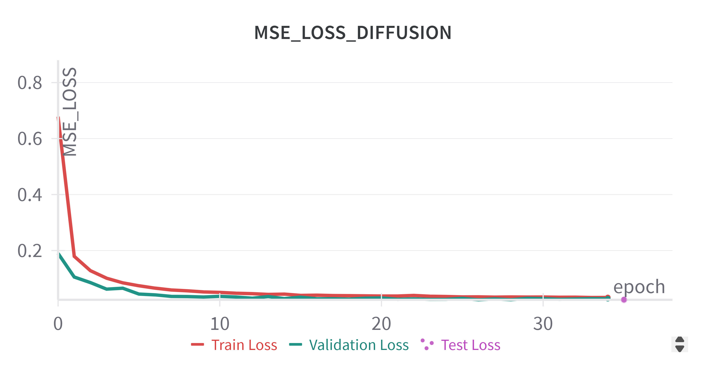

# **Specific Test IV. Diffusion Models**

- Trained DDIM model for learning data distribution to simulate realistic strong gravitational lensing images.
- DiffusionModel config:
    - ``` image_size: 152```
    - ```timesteps: 50```
    - ```objective: 'pred_v'```
    - ```beta_schedule : 'cosine'```
- In detailed implementation description : [code](../diffusion/architecture/model.py) , [config](../diffusion/config.yaml)
- Minimized reconstruction **Mean Squared Error(MSE)** for training the model.
- Below I attach the training curve for inspection. 

<div align="center">
    
    <br>
    <strong>Figure: Diffusion MSE Loss</strong>
</div>

---

| Metric      | Value                |
|-------------|----------------------|
| **FID Score** | `72.42`               |

The in-detailed logging of FID score is provided [here](../logs/diffusion_fid_eval.log).

---

## **Qualitative Analysis**

- **High Noise → Stronger Signal in pred_v**
    - When the noisy latent x has high noise (early timesteps, close to 𝑡=𝑇), pred_v carries a stronger correction signal to reverse this noise.
    - pred_v contains more structure and detail because the model predicts how to move toward the original image from a highly noisy state.

- **Low Noise → Weaker Signal in pred_v**
    - As noise decreases (later timesteps, close to t=0), x approaches x_start, and the required correction becomes minimal.
    - pred_v in these stages contains less pronounced structure, as most details are already restored


The ```pred_v``` (Model Output), ```x_start``` , ```noisy``` are logged after every 5 epochs in wandb to assess model training qualitatively. 

### **See report [here](https://wandb.ai/shri_krishna/DeepLense_Diffusion_Task/reports/Diffusion-Model-Qualitative-Analysis--VmlldzoxMjA2NzQyNg?accessToken=a7wuhcvr0bhycyprb8um56yurdjzjx5f7jxgde6gjny61h44557zsji42op7ye8k)**
