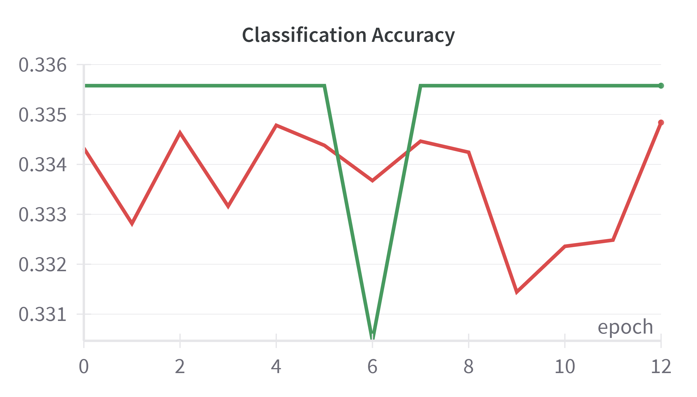
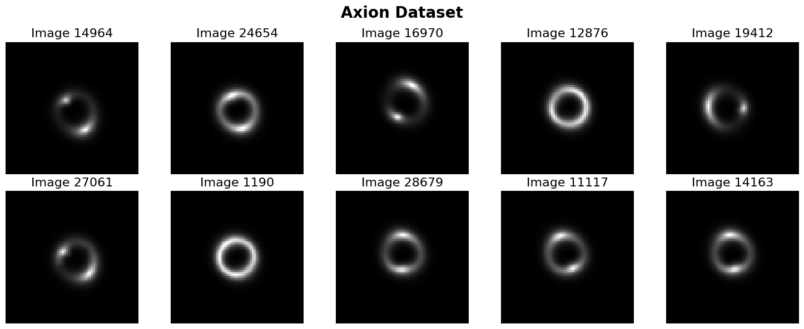
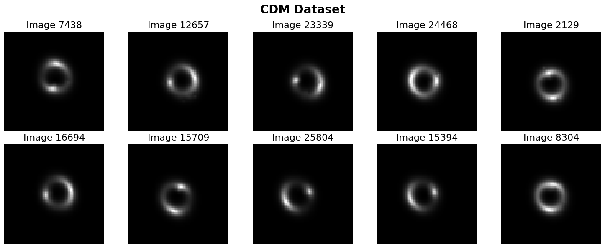
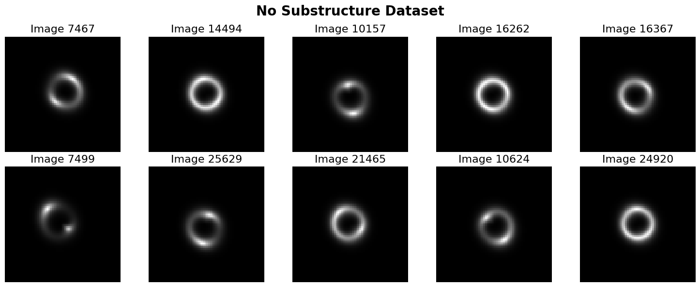
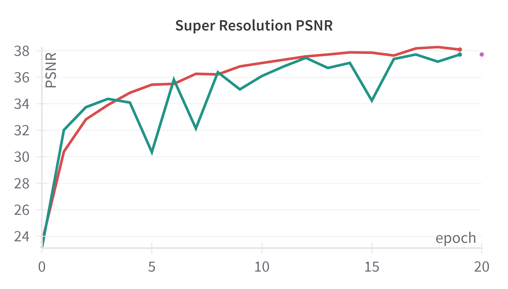
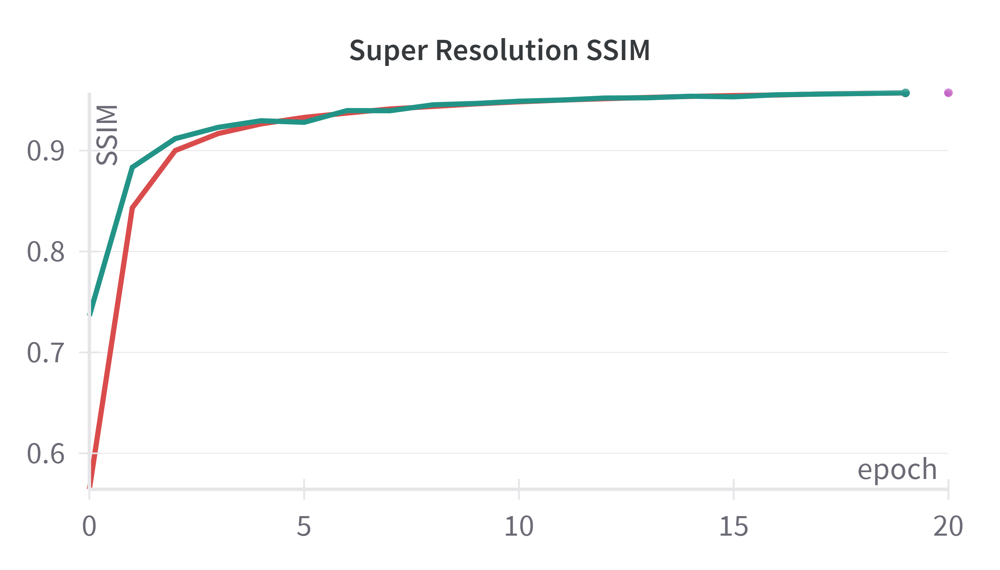

# **Specific Test VI. Foundation Model**

<!-- ### Task VI.A: 
* Train a ```Masked Autoencoder (MAE)``` on the no_sub samples from the provided dataset to learn a feature representation of strong lensing images. The MAE should be trained for reconstructing masked portions of input images. Once this pre-training phase is complete, fine-tune the model on the full dataset for a multi-class classification task to distinguish between the three classes. Please implement your approach in PyTorch or Keras and discuss your strategy.
* ```Dataset```: https://drive.google.com/file/d/1znqUeFzYz-DeAE3dYXD17qoMPK82Whji/view?usp=sharing
* ```Dataset Description```: The Dataset consists of three classes: no_sub (no substructure), cdm (cold dark matter substructure), and axion (axion-like particle substructure).
* ```Evaluation Metrics```: ROC curve (Receiver Operating Characteristic curve) and AUC score (Area Under the ROC Curve) 

### Task VI.B: 
* Take the pre-trained model from Task VI.A and ```fine-tune it for a super-resolution task```. The model should be fine-tuned to upscale low-resolution strong lensing images using the provided high-resolution samples as ground truths. Please implement your approach in PyTorch or Keras and discuss your strategy.
* ```Dataset```: https://drive.google.com/file/d/1uJmDZw649XS-r-dYs9WD-OPwF_TIroVw/view?usp=sharing
* ```Dataset Description```: The dataset comprises simulated strong lensing images with no substructure at multiple resolutions: high-resolution (HR) and low-resolution (LR).
* ```Evaluation Metrics```: MSE (Mean Squared Error), SSIM (Structural Similarity Index), PSNR (Peak Signal-to-Noise Ratio) -->


## **Solution**
The solution is divided in 3 stages : 
 - Pretraining of ViT using MAE ([code](../foundation_models/architectures/mae.py), [config](../foundation_models/configs/pre_training_config.yaml), [architecture](../pics/MAE_Pretraining.png))
 - Task-4A : Classification (axion, cdm, no_sub) ([code](../foundation_models/architectures/vit.py), [config](../foundation_models/configs/classification_finetuning_config.yaml), [architecture](../pics/ViT_Classification.png))
 - Task-4B : Super Resolution ([code](../foundation_models/architectures/super_resolution.py), [config](../foundation_models/configs/super_res_config.yaml), [architecture](../pics/SuperResolutionAE.png)) 


### **Pretraining of ViT using MAE**
Performed pretraining of ViT architecture using **Masked-AutoEncoder** on unlabelled data of `no_sub samples` from the provided dataset to learn a feature representation of strong lensing images. Used **Mean Squared Loss (MSE Loss)** for this pre-training setup. Below I attach the training curves of pre-training:


<div align="center">
    
    <br>
    <strong>Figure: Pretraining MSE Loss (train->red , validation-> green, test -> purple)</strong>
</div>

---

### **Task-4B: Classification** 🏷️

- Utilized a **pretrained ViT encoder** 🧠 with an `mlp_head classifier` ➕ for classifying into:
    - **axion** ⚛️
    - **cdm** 🌑
    - **no_substructure** 🚫
- **Unexpected Stagnation** 📉: Model accuracy plateaued at ~33% (random guessing baseline).
- **Visual Inspection** 👀: Images across all classes appeared **visually identical**.
    - Tried various training settings ⚙️, but stagnation persisted.
    - Spent the **most time** ⏳ on this task.
    - **Data visualization** 📊 ultimately suggested a lack of learnable patterns.
- **Contrasting Performance** 🤔: The **same pretrained ViT** performed well in **super-resolution** 🖼️⬆️ (see Task-4B results).
- **Conclusion** 💡: The classification dataset likely **lacks distinctive features** for the model to learn effectively, rather than an issue with the encoder itself.

<div align="center">
    
    <br>
    <strong>Figure: Classification Accuracy (train->red , validation-> green)</strong>
    
</div>

<div align="center">
    
    <br>
</div>
<div align="center">
    
    <br>
</div>
<div align="center">
    
    <br>
</div>

---

### **Task-4B : Super Resolution**
- Used the pretrained ViT encoder from the Masked Autoencdoer. Then, replaced the light decoder of MaksedAutoEncoder with more robust and modern [design decoder](../pics/SuperResDecoder.png) with attention and skip connection for better gradient flow.
- Trained the super-resolution autoencoder using layer-wise learning rate, low for pretrained encoder
    - ``` encoder_learning_rate = decoder_learning_rate * 50```
    - where ```decoder learning rate = 1.0e-4```
- **Objective :** ```Low resolution (75x75) --> High Resolution (150, 150)```
    - Padded both images so that patching (4x4) can be possible => ```Low resolution (76x76) --> High Resolution (152, 152)```
    - The encoder returned feature map of shape => ```(batch, 1, 19 , 19)```   ... where , (19= 76/4)
    - The super resolution decoder needs to upscale the encoded feature map 8x ```[19x19 => 152x152]```
- Minimized **Mean Squared Error (MSE)** to train the super-resolution autoencoder, also performed quantitative analysis using metrics like SSIM, PSNR and also qualitative analysis as shown below.


<div align="center">
    
    <br>
    <strong>Figure: Super-Resolution MSE Loss (train->red , validation-> green, test -> purple)</strong>
</div>
<div align="center">
    
    <br>
    <strong>Figure: Super-Resolution MSE Loss (train->red , validation-> green, test -> purple)</strong>
</div>
<div align="center">
    
    <br>
    <strong>Figure: Super Resolution SSIM (train->red , validation-> green, test -> purple)</strong>
</div>

---

## **Qualitative Analysis of Super Resolution Task**
- The quality of images generated as training progresses in wandb. I request to visit the **[report link](https://wandb.ai/shri_krishna/DeepLense_Diffusion_Sweep/reports/Super-Resolution-Qualitative-Analysis--VmlldzoxMjA2Njk2OQ?accessToken=jo8qz9hyv17gd3tk83bsc7o4zxn1uc4qxnrajj61z6zq5l8rv4vl1wq63syqzfda)** for close inspection of quality.